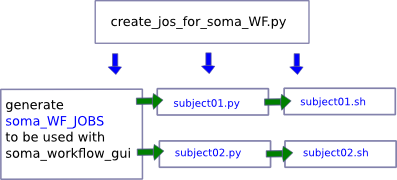

# SOMA-WORKFLOW TUTORIAL

## WHAT IS SOMA-WORKFLOW ?
Soma-workflow is an interface for submission, control and monitoring of jobs on parallel computing resources.
Here, we are going to describe the case for which you want to use gabriel server, available
at NeuroSpin.
One parallel computing resource could be your own computer by using all processors or a specific cluster like Gabriel at NeuroSpin.
Jobs are launched in parallel and not one after the other.

More information on [http://brainvisa.info/soma-workflow-2.8/sphinx/](http://brainvisa.info/soma-workflow-2.8/sphinx/)
and [https://github.com/neurospin/soma-workflow](https://github.com/neurospin/soma-workflow) 

## HOW CAN I LAUNCH MY JOBS WITH SOMA WORKFLOW ?
You can use soma-workflow in two ways:

* <a id=config_1 href="#config_1">only on your own workstation - see configuration (1) </a>: if your machine is multi-core, Soma-workflow optimizes the use of resources on your PC.
* <a id=config_2 href="#config_1">on a cluster - see configuration (1) & (2) </a>: if you have an access to a cluster, Soma-workflow is an interface (graphical or not) for submission, control and monitoring jobs. 

Please, note that:

| On your own workstation         | On a cluster     |
| --------------------------------|-----------------|
|Uncompiled MATLAB codes: Yes     | Uncompiled MATLAB codes: No (1)   |
|Compiled MATLAB codes: Yes       | Compiled MATLAB codes: Yes   |

1 : a MATLAB compiler is available at NeuroSpin.  

## INSATALLATION / CONFIGURATION / EXAMPLES
### INSTALLATION:
#### MODULE INSTALLATION
All information on [https://github.com/neurospin/soma-workflow](https://github.com/neurospin/soma-workflow).

| On your own workstation        | On a cluster     |
| -------------------------------|-----------------|
|Install soma-workflow  ([1](#config_1))  &nbsp;&nbsp;&nbsp;| Install soma-workflow [(2](#config_2) ) |
|Install dependencies of soma-workflow pyro, paramiko   ([2](#config_2)) &nbsp;&nbsp;&nbsp;| Install dependencies of soma-workflow ([2](#config_2)) |

[https://github.com/irmen/Pyro3](https://github.com/irmen/Pyro3)

[https://github.com/paramiko/paramiko](https://github.com/paramiko/paramiko)

HOW INSTALL A MODULE PYTHON:

Here is an example with soma-workflow:

	$ cd <somewhere>
	$ git clone https://github.com/neurospin/soma-workflow.git
	$ cd soma-workflow
	$ python setup.py install --user
	
The --user allows to install the module in /home/~/.local. In this case you don't need root permissions, but the
module is available only for you. The module will be automatically found. 

#### LAUNCH soma_workflow_gui GRAPHICAL INTERFACE

Add the following line into your ~/.bashrc:

	export PATH=~/.local/bin/:$PATH
	
Launch the soma_workflow_gui interface into a terminal:

	$ soma_workflow_gui 
	
If you want to check where is located the soma_workflow_gui :

	$ which soma_workflow_gui 

### CONFIGURATION:
#### CLIENT CONFIGURATION: 
On your PC, edit the following file:

    /home/your_logging/.soma-workflow.cfg

Add the following lines for the configuration:

    [DSV_cluster_your_logging]
    #remote access information
    CLUSTER_ADDRESS     = gabriel.intra.cea.fr
    SUBMITTING_MACHINES = gabriel.intra.cea.fr
    #optional on client
    QUEUES = run32 Global_long Global_short 
    #optional login for the GUI
    LOGIN = your_logging

#### SERVER CONFIGURATION:
The "server" refers to the resource called Gabriel:
[See information on wiki](http://www.neurospin-wiki.org/pmwiki/Main/ComputationalResources)

STEP1:
Connect to gabriel from your workstation with the login/pw given for gabriel:

    ssh your_logging_for_gabriel@gabriel.intra.cea.fr

STEP2:
On the server, edit the following file:

    /home/your_logging/.soma-workflow.cfg

Add the following lines for the configuration ([with vi](http://www.neurospin-wiki.org/pmwiki/Main/LINUX), to edit file into a console):

    [DSV_cluster_your_logging]
    NATIVE_SPECIFICATION = -l walltime=20:00:00
    DATABASE_FILE        = /home/your_logging/soma-workflow/soma_workflow.db
    TRANSFERED_FILES_DIR = /home/your_logging/soma-workflow/transfered-files/
    NAME_SERVER_HOST     = gabriel.intra.cea.fr
    SERVER_NAME          = soma_workflow_database_your_logging
    DRMAA_IMPLEMENTATION = PBS
    SERVER_LOG_FILE   = /home/your_logging/soma-workflow/logs/log_server
    SERVER_LOG_FORMAT = %(asctime)s => line %(lineno)s: %(message)s
    SERVER_LOG_LEVEL  = ERROR
    ENGINE_LOG_DIR    = /home/your_logging/soma-workflow/logs
    ENGINE_LOG_FORMAT = %(asctime)s => %(module)s line %(lineno)s: %(message)s %(threadName)s
    ENGINE_LOG_LEVEL  = ERROR
    PATH_TRANSLATION_FILES =
    MAX_JOB_IN_QUEUE = {5} run32{5} Global_long{5}

STEP3:
Create the following directories, if needed:

    mkdir /home/your_logging/soma-workflow
    mkdir /home/your_logging/soma-workflow/logs
    mkdir /home/your_logging/soma-workflow/soma-workflow
    mkdir /home/your_logging/soma-workflow/transfered-files

STEP4:
Launch the soma-workflow engine on Gabriel (if soma_workflow is not started on your gabriel account, 
you can't launch soma-workflow_gui from your workstation):

    python -m soma_workflow.start_database_server DSV_cluster_your_logging
    #to move the programm in background, use ctrl + Z then tape bg

Check if soma_workflow.start_database_server is started:

    ps -aux | grep your_logging

If you have a line like the one below, the configuration is correct:

    python -m soma_workflow.start_database_server DSV_cluster_your_logging &

If the server has been stopped, you have to launch again the soma-workflow engine.

### EXAMPLES:
#### SIMPLE EXAMPLE:

STEP1:
Create a job_to_launch.py python file into /tmp/python_file/:

	# -*- coding: utf-8 -*-
	import os
	import subprocess

	cmd = "touch  /tmp/file_test.txt" 
	subprocess.call(cmd, shell=True)
	
	
STEP2:
Create a /tmp/create_somaWF_jobs.py python file to generate your soma_workflow_job into:

	# -*- coding: utf-8 -*-
	import os, sys, glob
	from soma_workflow.client import Job, Workflow, Helper

	if len(sys.argv)==1:
		list_scripts = glob.glob("/tmp/python_file/job_to_launch.py")
	else:
		list_scripts= sys.argv[1:]

	jobs = []
	for f in list_scripts:
		jobs.append(Job(command=["python", os.path.abspath(f)], name=f)

	workflow=Workflow(jobs)
	Helper.serialize('test_script_python.somawf', workflow)

	
This step creates a /tmp/test_script_python.somawf file.

STEP3:
Launch the soma_workflow_gui

	$ soma_workflow_gui
	#open and submit the /tmp/test_script_python.somawf
	
STEP4:
Check if a /tmp/file_test.txt was created.

#### EXAMPLE WITH FREESURFER:
An example is available on the unicog module: 

    cd
    
    #if you have not already cloned unicog.git and installed it:
    git clone https://github.com/neurospin/unicog.git
    cd unicog
    python setup.py install --user
    
    cd ./unicog/utils_unicog/computing_resources/example
    
    #create your own script from a copy
    #change what the paths and configure your freesurfer database 
    cp example_somaWF_for_freesurfer.py example_somaWF_for_freesurfer_local.py
    
    #launch the script
    python example_somaWF_for_freesurfer.py

This script generates the blue files. The **soma_WF_JOBS** script must 
be used in **soma-workflow_gui** for launching the jobs on the server or
on your own workstation (if many cores).

### EXAMPLE FOR SPM BATCHES:
An example is available on the unicog module: 

    cd
    
    #if you have not already cloned unicog.git and installed it:
    git clone https://github.com/neurospin/unicog.git
    cd unicog
    python setup.py install --user 
    
    cd ./unicog/unicogfmri/utils_unicog/computing_resources/example
    
    #create your own script from a copy
    #and init some variables with the following script if needed
    cp example_somaWF_for_spm_batches.py example_somaWF_for_spm_batches_local.py
    
    #launch the script
    python example_somaWF_for_spm_batches.py

This must generate a file called **spm12_batches.somawf** which must be
used in **soma-workflow_gui** for launching the jobs on the server or
on your own workstation (if many cores).

### ADDITIONAL INFORMATION WITH YOU USE IN INTERACTION WITH BRAINVISA:

STEP1:
Add the following lines for the configuration of **.soma-workflow.cfg** [with vi](http://www.neurospin-wiki.org/pmwiki/Main/LINUX):

    PATH_TRANSLATION_FILES = brainvisa{/home/your_logging/.brainvisa/soma-workflow.translation}

STEP2:
Open the .bashrc file and check if the following lines exist, if not, add them:

    # .bashrc
    # Source global definitions
    if [ -f /etc/bashrc ]; then
        . /etc/bashrc
    fi

    # User specific aliases and functions
    if [ -f /i2bm/local/etc/bashrc ]; then
       . /i2bm/local/etc/bashrc
    fi

    if [ -f /i2bm/local/etc/profile ]; then
       . /i2bm/local/etc/profile
    fi 

And add the following lines:

    export I2BM_OSID=CentOS-5.11-x86_64
    
    export PYTHONPATH=/i2bm/brainvisa/$I2BM_OSID/python-2.7.3/lib/python2.7:$PYTHONPATH
    export PYTHONPATH=/i2bm/brainvisa/$I2BM_OSID/python-2.7.3/lib/python2.7/site-packages:$PYTHONPATH
    export PATH=/i2bm/brainvisa/$I2BM_OSID/python-2.7.3/bin:$PATH
    export LD_LIBRARY_PATH=/i2bm/brainvisa/$I2BM_OSID/python-2.7.3/lib:$LD_LIBRARY_PATH
    export LD_LIBRARY_PATH=/i2bm/brainvisa/$I2BM_OSID/pbs_drmaa-1.0.13/lib/:$LD_LIBRARY_PATH
    export LD_LIBRARY_PATH=/usr/lib64/openmpi/lib:${LD_LIBRARY_PATH}
    export DRMAA_LIBRARY_PATH=/i2bm/brainvisa/$I2BM_OSID/pbs_drmaa-1.0.13/lib/libdrmaa.so
    
    source /i2bm/brainvisa/$I2BM_OSID/brainvisa/bin/bv_env.sh /i2bm/brainvisa/$I2BM_OSID/brainvisa

STEP3:
In order to complete the configuration (initialisation of PATH_TRANSLATION_FILES in .soma-workflow.cfg),
launch Brainvisa just once. So, quit the server side (gabriel), then relog with the option -X to indicate the graphic mode.

    ssh  -X your_logging@gabriel.intra.cea.fr
    #launch brainvisa
    brainvisa
    #and just close the graphical interface of Brainvisa.

